## Дисклеймер.

При выполнении задания я опирался на https://www.avito.ru.  
В текущей версии есть много отличий от скриншота, но основные механики старался проверить в сравнении с действующим сайтом.  
Из отсутствия шагов, которые привели к данному состоянию страницы сложно оценить релевантность выдачи и дефекты.  
Могу только предположить что шаги были следующие:

1. Перейти в нужную категорию.
2. Установить фильтры.
3. Нажать кнопку "Найти объявления"
4. Перейти на последнюю страницу.
5. Изменить фильтры (например "Правила") пока кнопка "Найти объявления" не поменятся на "Ничего не найдено"

## Дефекты

### DEF_01

**Дефект**: Опечатка в кнопке поиска "Найти"  
**Приоритет**: High  
**Комментарий**: Блок поиска сквозной по всему сайту. Опечатку увидит каждый пользователь. Может повлиять на репутацию компании.  
**Скриншот**: 

---

### DEF_02

**Дефект**: Хлебные крошки не соответствуют странице  
**Приоритет**: Medium  
**Комментарий**: Пользователи редко используют данную функцию, на ней мало внимания. Для приоритета необходимо выяснить воспроизводимость в других категориях/фильтрах. Также может повлиять на SEO страницы и её позиции в поиске.  
**Скриншот**: 

---

### DEF_03

**Дефект**: Выбранный город в фильтре "Где искать" не соответствует виджету мини-карты  
**Приоритет**: High  
**Комментарий**: Выдача результатов поиска по городу Санкт-Петербург. (Нужны шаги воспроизведения.)  
**Скриншот**: 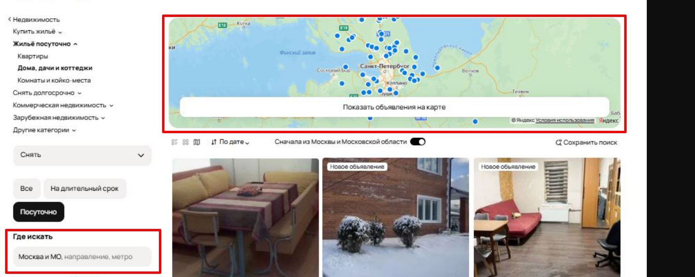

---

### DEF_04

**Дефект**: Фильтр "Где искать" не влияет на результаты выдачи  
**Приоритет**: High  
**Комментарий**: Основной функционал страницы. (Нужны шаги воспроизведения.)  
**Скриншот**: 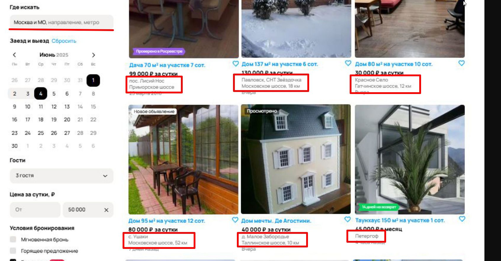

---

### DEF_05

**Дефект**: Иконка "Поиск по карте" активна в блоке изменения представления объявлений  
**Приоритет**: Low / Medium  
**Комментарий**: Второстепенная функциональность. Если это только визуальное отображение — Low. Если при нажатии не происходит перехода на поиск по карте или переключения режима отображения — Medium.  
**Скриншот**: 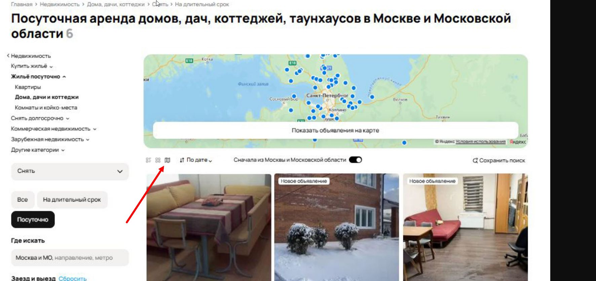

---

### DEF_06

**Дефект**: Фильтр "Цена за сутки" не влияет на результаты выдачи  
**Приоритет**: High  
**Комментарий**: Основной функционал страницы. (при условии что его не изменяли после поиска)  
**Скриншот**: 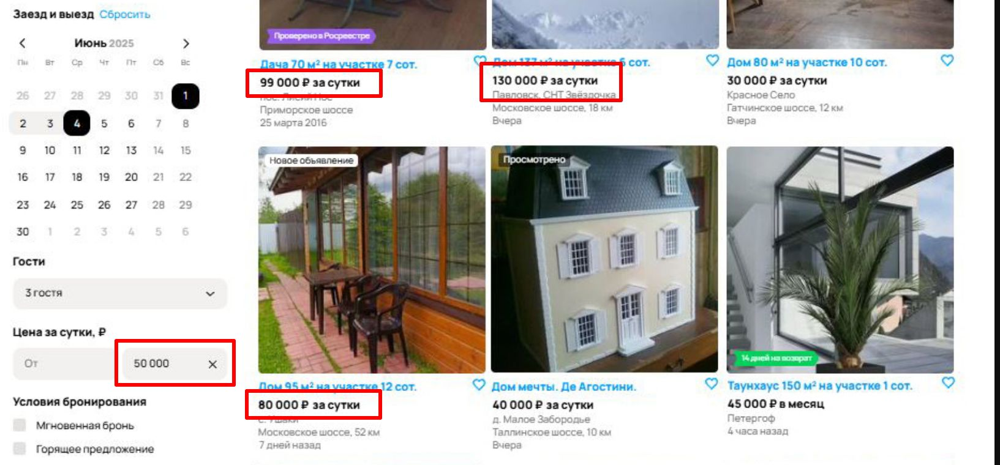

---

### DEF_07

**Дефект**: Опечатка в плейсхолдере фильтра "Площадь участка"  
**Приоритет**: Low  
**Комментарий**: Небольшая опечатка. На функционал не влияет, слабо заметна. Присутствует только на определённых страницах.  
**Скриншот**: 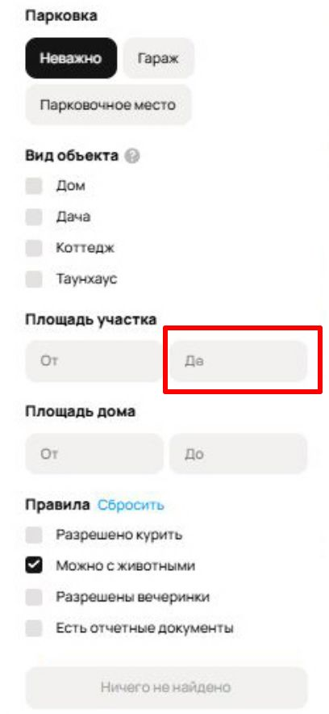

---

### DEF_08

**Дефект**: Ошибка в подсчёте количества объявлений в заголовке H1  
**Приоритет**: Medium  
**Комментарий**: Дезинформация пользователя. Также может повлиять на SEO страницы и её позиции в поиске.  
**Скриншот**: 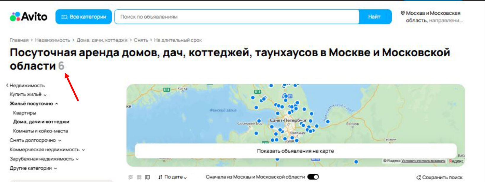

---

### DEF_09

**Дефект**: Опечатка в категории "Комнаты и койко-места" в футере, блок "Путешествия"  
**Приоритет**: Low  
**Комментарий**: Небольшая опечатка. На функционал не влияет, слабо заметна. Находится в футере и видит менее чем 1% пользователей.  
**Скриншот**: 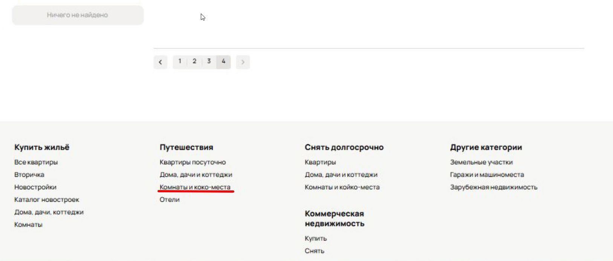

---

### DEF_10

**Дефект**: Ошибка в расчёте цены "за весь период" в категории "Дома, дачи, коттеджи / Снять"  
**Приоритет**: Medium / High  
**Комментарий**: Дезинформация пользователя, ошибка в формуле подсчёта цены. Возможна ссылка на документ "Публичная оферта" — нужно уточнить, какую ответственность несёт компания. Возможен приоритет High.  
**Скриншот**: 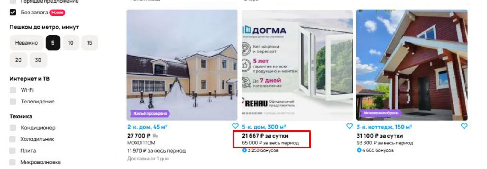

---

### DEF_11

**Дефект**: Отображается блок "Ничего не найдено" после всех объявлений  
**Приоритет**: Medium  
**Комментарий**: Не влияет на функционал, UI-дефект. Если отображается только на последних страницах — можно понизить до Low. (Но если по данным фильтрам в целом не было найдено объявлений и этот блок должен был быть ДО объявлений, приоритет — High.)  
**Скриншот**: 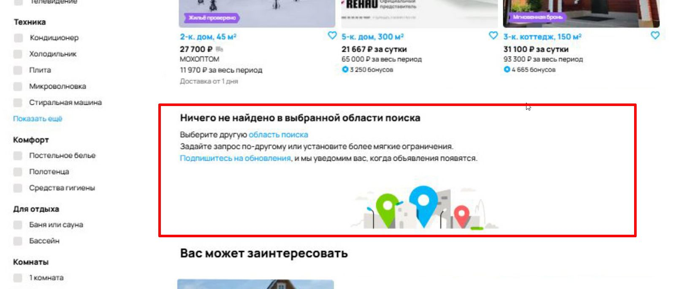

---

### DEF_12

**Дефект**: Отсутсвует строка с ценой "за весь период", в категории "Дома, дачи, коттеджи / Снять", при установленном фильтре "Заезд и выезд"
**Приоритет**: Medium  
**Комментарий**: На основной функционал не влияет, но существенно скажется на пользовательском опыте.  
**Скриншот**: 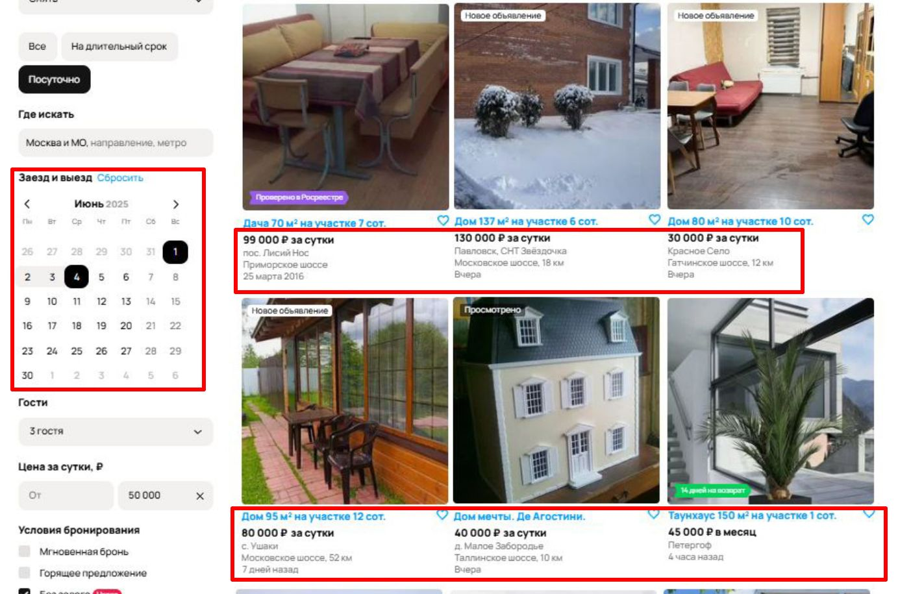

---

## Спорные объявления и дефекты

### DEF_13

**Дефект**: Объявление "Дом мечты. Де Агостини" не соответствует категории  
**Приоритет**: Medium  
**Комментарий**: Нерелевантное объявление. Для приоритета необходимо выяснить воспроизводимость в других категориях/фильтрах и его частоту.  
**Скриншот**: 

---

### DEF_14

**Дефект**: В строке цены не указан период "за сутки / месяц" в объявлении "2-к. дом, 45 м²"  
**Приоритет**: Low / Medium  
**Комментарий**: Нерелевантное объявление. Для приоритета необходимо выяснить воспроизводимость в других категориях/фильтрах и его частоту.  
**Скриншот**: 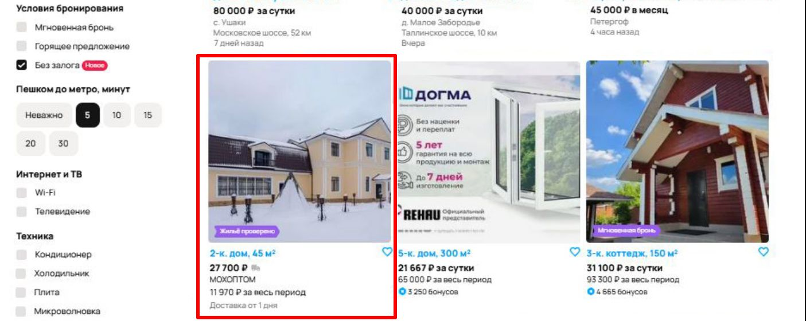

---

### DEF_15

**Дефект**: Иконка "Доставка от 1 дня" и цена в объявлении о доме  
**Приоритет**: High  
**Комментарий**: Дефект может не относиться к данной странице. На функционал не влияет. Нужно исследовать само объявление и соответствующий функционал.  
**Скриншот**: 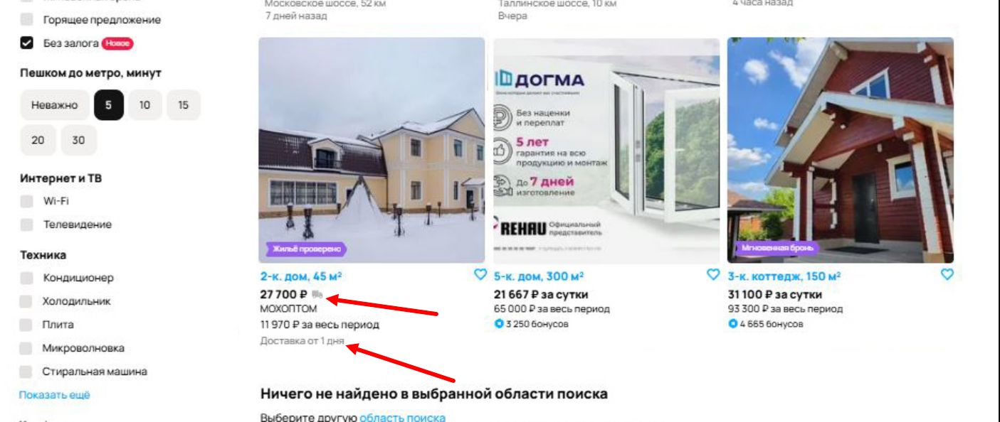

---

### DEF_16

**Дефект**: Нерелевантный стикер "14 дней возврата" в категории "Дома, дачи, коттеджи / Снять"  
**Приоритет**: High  
**Комментарий**: Дефект может не относиться к данной странице. На функционал не влияет. Нужно исследовать само объявление и соответствующий функционал.  
**Скриншот**: 
